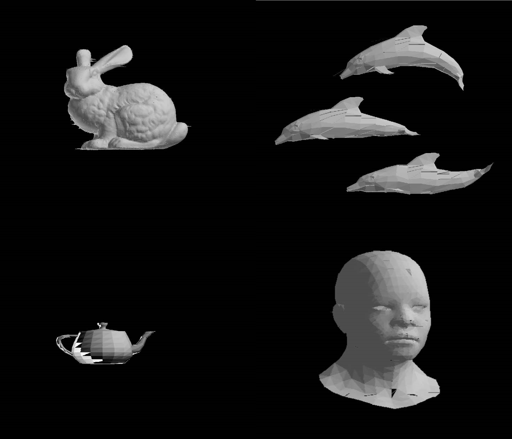

# Overview

基于扫描线方法的光栅化和深度测试。

|类|主要属性|主要属性|主要方法|
|---|---|---|---|
|Vector3D|三维空间中的点，或向量|三维空间左边x，y，z|加减、数乘、叉乘、内积等向量运算|
|Light|光源|光的颜色、方向||
|Triangle|三角形|顶点、法线等|计算平面方程、计算偏导数|
|Model|网格模型|顶点、面、法线|载入Wavefront模型，计算光照效果|
|Z_buffer|执⾏扫描线zbuffer算法|多边形表、边表、活性边表、活性多边形表、帧缓冲、深度缓冲、颜⾊缓冲|投影、初始化多边形表、边表，扫描|

# Build & Run

依赖OpenCV来显示。若使⽤Debug模式编译，则静态链接opencv_world460d.lib；若使⽤Release模式编译，则静态链接
opencv_world460.lib。

通过修改main.cpp中的Model::load函数的参数来指定模型程序成功运⾏后，可使⽤键盘“A”和“D”键来旋转模型。

# Performance

- 操作系统：Windows 11 64位
- 处理器：Intel(R) Core(TM) i5-8250U CPU @ 1.60GHz 1.80 GHz
- 内存：DDR4 8G
- IDE：Microsoft Visual Studio 2017 x64
- 依赖库：OpenCV 4.6.0(⽤于显⽰图像)

|模型|面数|用时/帧|
|--|--|
|bunny|89451|37ms|
|dolpins|1692|5ms|
|teapot|992|5ms|
|african_head|2492|9ms|

# Todo

绘制模型的某些⾯片会出现细⻓“⽑边”，有些⾯片之间与较⼤的空隙

# Examples

